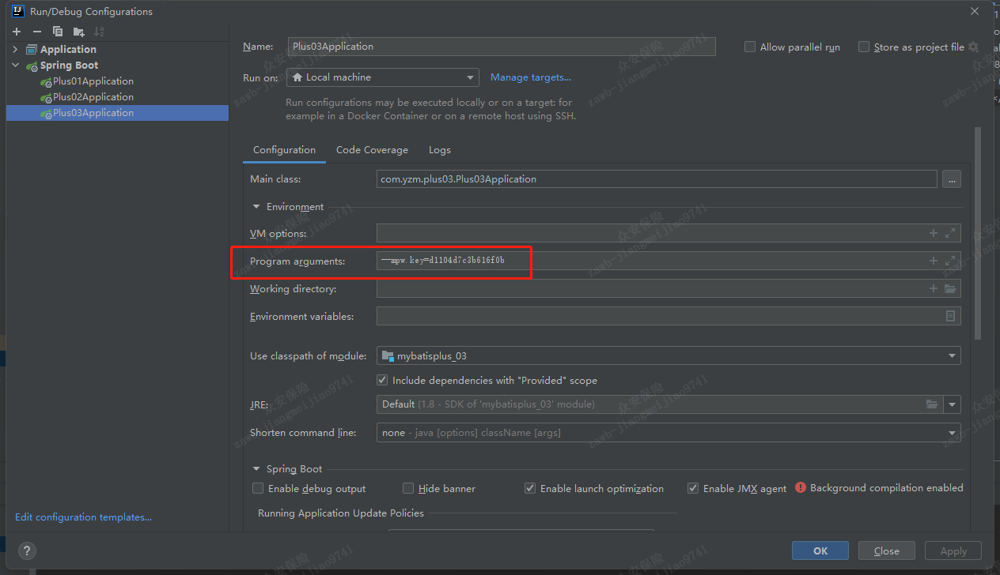

# 1.对需要加密的字符串进行加密
```text
RandomKey.java

秘钥：3c4fbd0417409088
加密的url：okPilpUF0EXmfWE649Leyyn9JyuEehOXmbPJ1gmXgxaUEMXVeLl+Hdni0M/+jInR15fw9nYNdMEoaMEEalgN/Dpicsrnv464WmpWPFL8a0sV9RHN3hPhapLEtwiBZVxgpJBLLpzMebL59jC5X75td1KFpH8I14xq6NLQ+YXyCt+uGFc/SkJfnskgG9Xh/Z/0REyxDbiMUnk/JzNVWhh8q/jSydYxHx56OZxcmbCI4UrURa6JJAMhJMkPYp2H//Fg
加密的username：UHFlRzvX3UX7TTAIDw6zDg==
加密的password：9IkA0v5o/lF3rJD8H5taHw==
```
# 2.配置文件修改为加密后的字符串
```text
spring:
  datasource:
    driver-class-name: com.mysql.cj.jdbc.Driver
    url: mpw:okPilpUF0EXmfWE649Leyyn9JyuEehOXmbPJ1gmXgxaUEMXVeLl+Hdni0M/+jInR15fw9nYNdMEoaMEEalgN/Dpicsrnv464WmpWPFL8a0sV9RHN3hPhapLEtwiBZVxgpJBLLpzMebL59jC5X75td1KFpH8I14xq6NLQ+YXyCt+uGFc/SkJfnskgG9Xh/Z/0REyxDbiMUnk/JzNVWhh8q/jSydYxHx56OZxcmbCI4UrURa6JJAMhJMkPYp2H//Fg
    username: mpw:UHFlRzvX3UX7TTAIDw6zDg==
    password: mpw:9IkA0v5o/lF3rJD8H5taHw==
```

# 3.启动时，增加启动参数
```text
--mpw.key=3c4fbd0417409088
```
